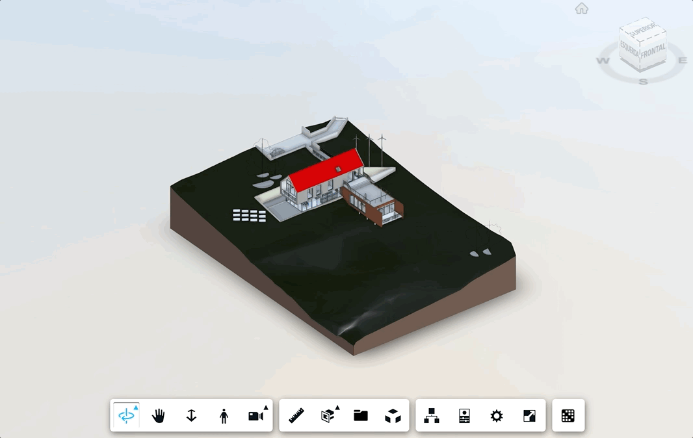

# Update CSV

Perfect, all great!
We're just missing two scenarios...

What if I need to update my chart with a different csv or I made some canges and need to export those?
That's what we'll cover now.

Simply copy the content below to `initialize` function of `PhasingPanel` class:

```js
//Here we add the button to update the csv
this.importbutton = document.createElement('button');
this.importbutton.innerHTML = 'IMPORT CSV';
this.importbutton.style.width = (this.options.buttonWidth || 100) + 'px';
this.importbutton.style.height = (this.options.buttonHeight || 24) + 'px';
this.importbutton.style.margin = (this.options.margin || 5) + 'px';
this.importbutton.style.verticalAlign = (this.options.verticalAlign || 'middle');
this.importbutton.style.backgroundColor = (this.options.backgroundColor || 'white');
this.importbutton.style.borderRadius = (this.options.borderRadius || 8) + 'px';
this.importbutton.style.borderStyle = (this.options.borderStyle || 'groove');

this.importbutton.onclick = this.importCSV.bind(this);
this.div.appendChild(this.importbutton);

//Here we add the button to export the Gantt as csv
this.exportbutton = document.createElement('button');
this.exportbutton.innerHTML = 'Export CSV';
this.exportbutton.style.width = (this.options.buttonWidth || 100) + 'px';
this.exportbutton.style.height = (this.options.buttonHeight || 24) + 'px';
this.exportbutton.style.margin = (this.options.margin || 5) + 'px';
this.exportbutton.style.verticalAlign = (this.options.verticalAlign || 'middle');
this.exportbutton.style.backgroundColor = (this.options.backgroundColor || 'white');
this.exportbutton.style.borderRadius = (this.options.borderRadius || 8) + 'px';
this.exportbutton.style.borderStyle = (this.options.borderStyle || 'groove');

this.exportbutton.onclick = this.exportCSV.bind(this);
this.div.appendChild(this.exportbutton);
```

Now we need to define both functions `importCSV` and `exportCSV` inside our `PhasingPanel` class:

```js
async exportCSV() {
  let tasks = this.gantt.tasks.map(task => `${task.id},${task.name},${task._start.toISOString().split('T')[0]},${task._end.toISOString().split('T')[0]},${task.progress},${Object.keys(phasing_config.mapTaksNProps).find(key => phasing_config.mapTaksNProps[key] === task.id)},${task.dependencies.join('-')}`);

  let header = Object.values(phasing_config.requiredProps);
  header.splice(5, 0, phasing_config.propFilter);
  tasks.splice(0, 0, header.join(','));

  let csvString = tasks.join("%0A");
  let a = document.createElement('a');
  a.href = 'data:attachment/csv,' + csvString;
  a.target = '_blank';
  a.download = 'Construction_Phasing_' + (new Date()).getTime() + '.csv';
  document.body.appendChild(a);
  a.click();
}

async importCSV() {
  await this.inputCSV();
  this.gantt = this.createGanttChart();
  this.handleColors.call(this);
}
```

And now we have our Schedule connected with the model. Hope you enjoyed it!

